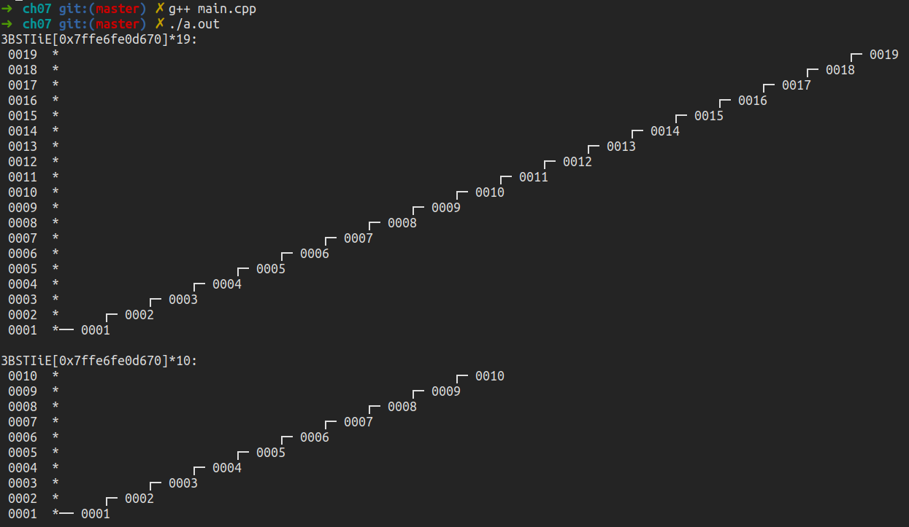

# 二叉搜索树  

## 不平衡的二叉树(BST)

[BST.hpp](./BST.hpp)  
[main.cpp](./main.cpp)  

会退化成一条链表：  

```cpp
#include "../_share/print.h"  

#define TIME 20

int main(){
    BST<int> bst;
    for(int i = 1; i < TIME; i++)
        bst.insert(i);
    print(bst);

    for(int i = TIME - 1; i > 10; i--)
        bst.remove(i);
    print(bst);
    return 0;
}
```  

  

