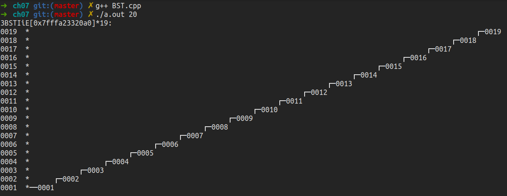
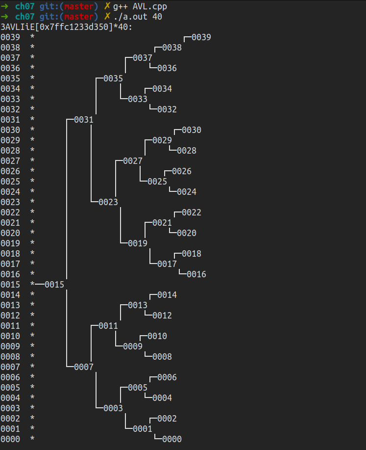
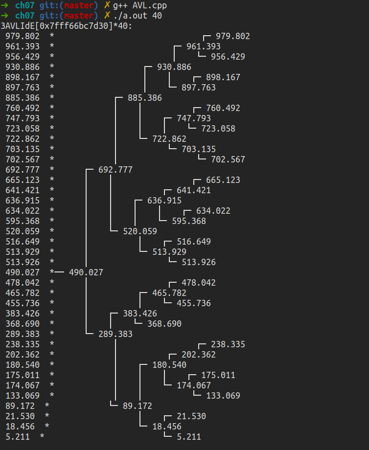

# 二叉搜索树  

## 不平衡的二叉树(BST)

[BST.hpp](./BST.hpp)  
[BST.cpp](./BST.cpp)    

会退化成一条链表：  

```cpp
#include "../_share/print.h"  

#define TIME 20

int main(){
    BST<int> bst;
    for(int i = 1; i < TIME; i++)
        bst.insert(i);
    print(bst);

    for(int i = TIME - 1; i > 10; i--)
        bst.remove(i);
    print(bst);
    return 0;
}
```  

  

## AVL树  

[AVL.hpp](./AVL.hpp)  
[AVL.cpp](./AVL.cpp)  

退化的链表将被转化为平衡树：

  

插入40个随机浮点值：  

  


> 因AVL的理想平衡，每个节点之间的差严格不能大与等于2，所以每次插入删除都要花费时间进行旋转调整，但作为回报，AVL有平衡树中最快的查询性能。  


