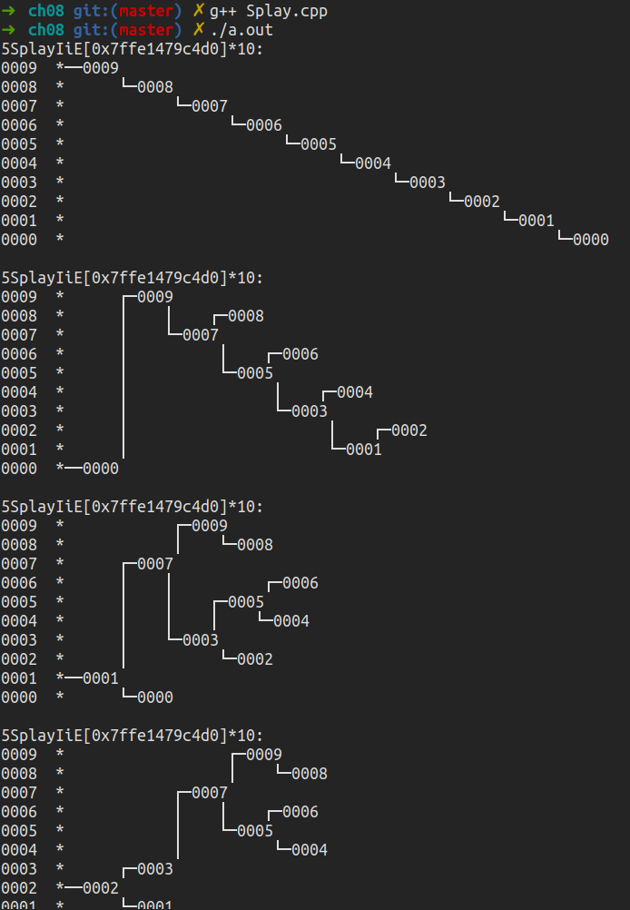
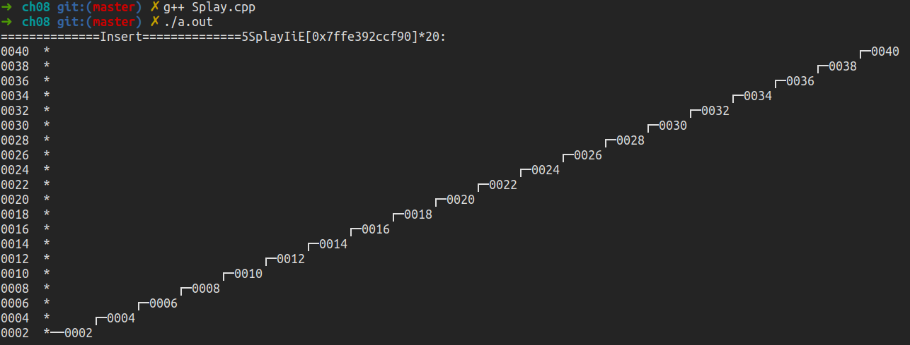
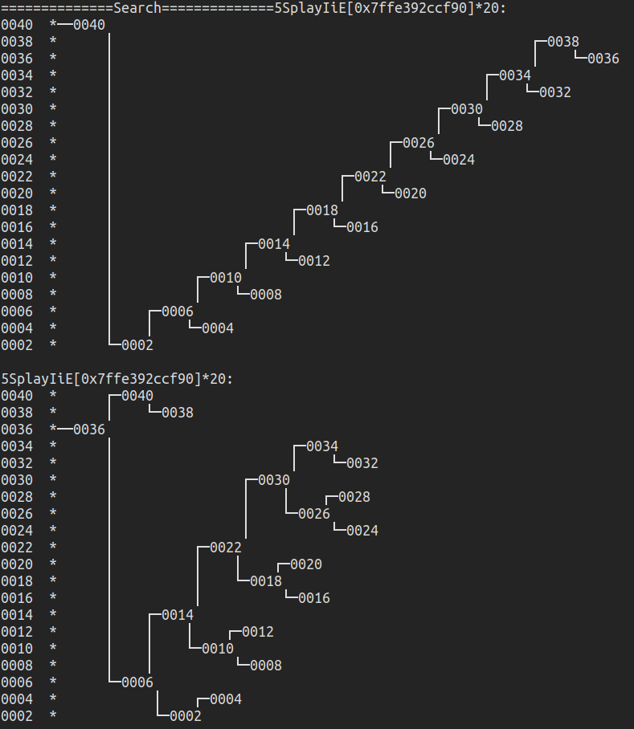
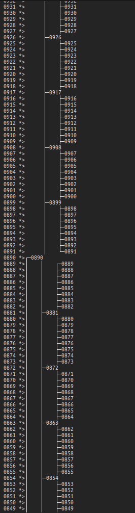
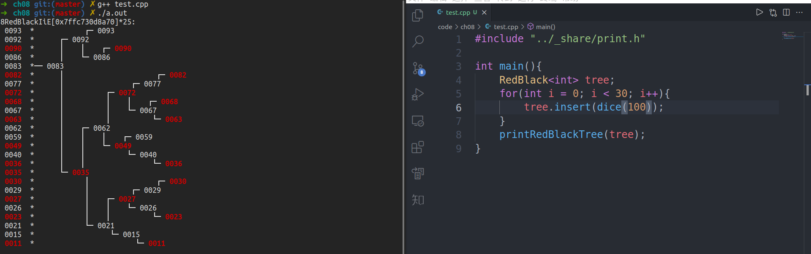
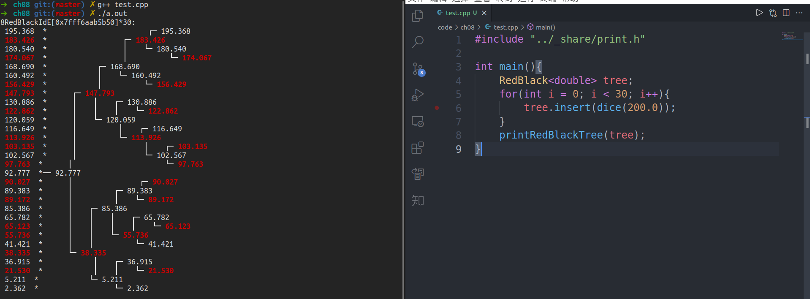
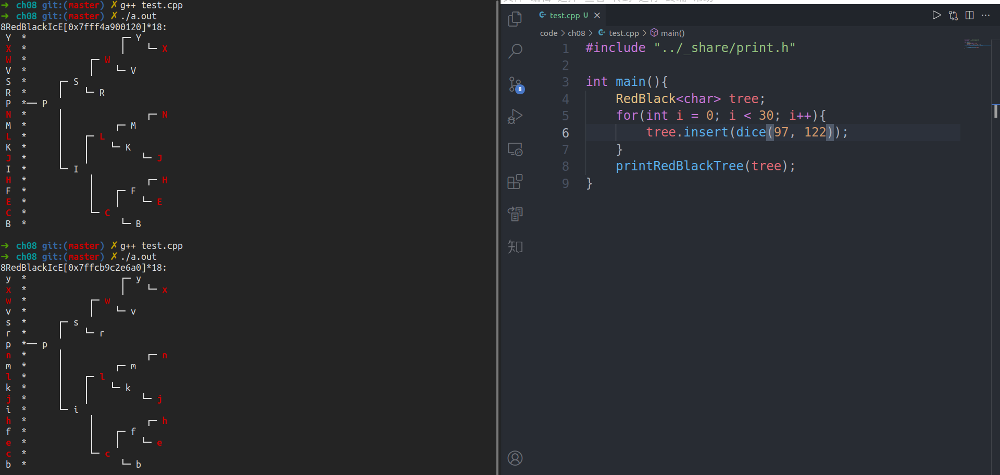

#  高级搜索树  

### Splay树

  

[Splay.cpp](./Splay.cpp)  
[Splay.hpp](./Splay.hpp)  

#### Insert  

  

#### search worst value (40 and 32)  

#### remove in-between value(22)  
 
  

> 伸展树看似退化成了一条单链，但其在查询时会伸展起来。运用了程序的局部性原理，将查询的元素置于根节点，若该节点不存在，则可采用其直接后继。  

> 伸展后的Splay树高度减半，总体复杂度可均摊分析。

> 伸展树没有雷同节点，故适用于局部性较强的应用场合。  

### BTree

[BTNode.hpp](./BTNode.hpp)  
[BTree.hpp](./BTree.hpp)  
[BTree.cpp](./BTree.cpp)  

  

> B-树 适用于数据库或者其他需要与磁盘进行IO操作的场合，已经不属于上述均在内存中操作的范畴内，大节点，有效利用cache命中性和vector的随机访问特性

### 红黑树/Red-Black Tree  

  
  
  

