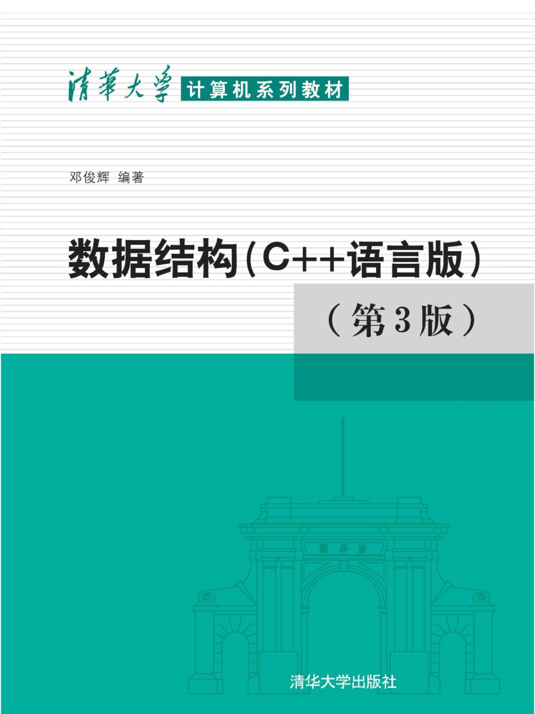

# 邓俊辉 数据结构（C++语言版）（第三版）  

- [1. 绪论](./code/ch01/readme.md)  
- [2. 向量](./code/ch02/readme.md) 
- [4. 栈与队列](./code/ch04/readme.md) 
- [5. 二叉树](./code/ch05/readme.md)  
- [7. 二叉搜索树](./code/ch07/readme.md)  
- [8. 高级搜索树](./code/ch08/readme.md)  

